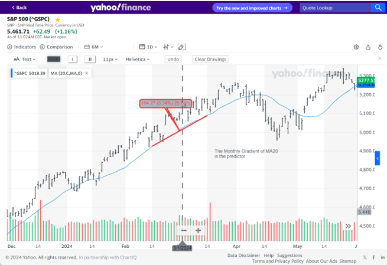

# STOCK MARKET FORECASTING

This small educational project was created during my studies in [ML/AI at Imperial College Business School](https://www.imperial.ac.uk/business-school/executive-education/technology-analytics-data-science/professional-certificate-machine-learning-and-artificial-intelligence-programme/online//). 

I was free to choose any task where I could demonstrate the material I had learned using real data. The availability of verified data for the stock market and economy, as well as the fact that I had once done a similar study about 20 years ago, predetermined my choice.

One of my fundamental conclusions from my previous research was that it is impossible to predict market behaviour in the short term based on publicly available information because it is driven by the actions of intelligent agents too complex for modelling and it is not stationary, meaning behaviour changes over time. Moreover, any opportunity to make money in the stock market is used by participants, making the market efficient, see the fundamental assumptions of Capital Asset Pricing Model by William F. Sharpe who received a Nobel Prize.

That's why I've long viewed the stock market forecasting as a frivolous task for a young data scientist trying to find the Holy Grail of the financial speculator. Like alchemists, they try to find the secret formula that will bring untold riches in the stock market, but almost all of them are doomed to failure.

However, I chose this problem as a case study because there is good quality data available and it is a brilliant learning exercise rather than another attempt to get rich quickly.

Besides the unpredictability of the short-term market, my second fundamental assumption is that the real economy and corporate profits, will eventually impact the stock market. This means that it is necessary to study the possibility of predicting the market behavior in the medium term, based on the leading economic indicators that are used, for example, by the Conference Board in the USA to build forecasts. The nuance is that the stock market itself is one of 10 such indicators, therefore: 
1. The stock market forecast should be medium-term
2. The forecast should be based on a combination of leading economic indicators and technical indicators of market prices

Based on my experience, I decided to use a 20 day moving average of the market and use the gradient as the main indicator for forecasting:

$$
MA_{20} = \frac{1}{20} \sum_{i=0}^{19} {Price}_{t-i}
$$

The predictor:

$$
\nabla{MA_{20}} = \frac{MA_{20}(today+20)-MA_{20}(today)}{MA_{20}(today)}
$$

For clarity, I have provided a picture below of the broad index Sp500 of American stocks, where the blue color shows the Moving Average and the red line shows the gradient that I am going to predict:

Since many models for market forecasting are not accurate, I will use another simple indicator of Accuracy - the percentage of times the model guess the direction of the market movement correctly. The Accuracy is calculated by comparing the sign of the MA20 gradient with the prediction and from the point of view of machine learning is a common classification metric.

For more technical details, read the code itself with comments and pictures. I chose to implement Pandas dataframe and save data in excel which I find convenient for the data analysis.

### Here I must make one important disclaimer: 
The data I use from the US Federal Reserve Database is intentionally delayed by a month or two, depending from the source. Therefore, this solution is not suitable for speculating on the stock market. At the very least, you need to access the most current data, which requires a paid subscription. That's why, in essence, the goal of the project is only to answer the following question:

**What is the accuracy of the medium-term forecasting of the stock market direction based on economic data and trading indicators?**

## FILES
The directory contains the following files:
* create_dataset.ipynb - The Jupyter Notebook script is used to create a main dataset and auxilirary data files. It should be run once at the begining when dataset does not exists.
* dataset.xlsx   - The excel file with main dataset of ~8k records with 30 features for training and testing spanning 32 years of real data from SP500.
* run_lr.ipynb   - The Jupyter Notebook script is to train Logistic Regression Model over dataset
* result_lr.xlsx - The result of LR training is in the last column
* run_dt.ipynb   - The Jupyter Notebook script is to train the Decision Tree Model
* result_dt.xlsx - The result of DT training is in the last column
* find_nn_architecture.ipynb - Implements Bayesian Optimization to find the best architecture of Neural Network
* hyperparameters.xlsx - The result of Bayesian optimization. It has the list of NN models sorted by Accuracy on test sample.
* run_nn.ipynb   - The Jupyter Notebook script is to train optimial Neural Network over dataset
* sp500.xlsx     - The excel file has SP500 price open, close and stock market forecast with the predicition from Neural Network for last 32 years.
* simulate_trading.ipynb - The Jupyter Notebook script is to simulate trades with SP500 index fund and average return calculation  
* trades.xlsx    - The result of trade simulation
* fred_data.xlsx - The auxiliary Excel file, by product of create_dataset, is used to analyze raw FRED data.
* ds.xlsx        - The auxiliary Excel file, byproduct of create_dataset, it has combined raw SP500 price and FRED data 
* model_card.md  - The model card with a more technical discussion of models
* data_sheet.md  - The data sheet for dataset

## THE DATA
I used two good sources of data which is publicly available:
1. [The Federal Reserve Economic Data](https://fred.stlouisfed.org/) (FRED) is an online database consisting of hundreds of economic data time series since last century. The FRED database was created and maintained by the Research Department at the Federal Reserve Bank of St. Louis. The good news is that FRED database is easily available through public Python [API for FRED](https://pypi.org/project/fredapi/)
2. [Yahoo Finance](https://finance.yahoo.com) is the well known publicly available source of stocks, indexes and commodities, supported by Yahoo Inc. The data is accessible in Python through [yfinance API module](https://pypi.org/project/yfinance/)

The data was downloaded from different sources and jointed by time index. Since economic indicators are released with less frequency than price, the  last known reading for that day was used. In this way, it was possible to obtain a large array of data for each trading day for the last 32 years from 1992-02-03 to 2024-07-01. Some of the metrics were normalized to make them stationary and suitable for machine learning like price normalization:

$$
pr_0 = \frac {Price_{today} - MA_{20}}{MA_{20}} 
$$

The testing and training data split is usually as 80% to 20%. The data were checked on multicolinearity via variance inflation factor. In result some indicators was not accepted in dataset.

## MODELS 
All models accept the dataset.xlsx wich stores Pandas dataframe with 30 features from economic and stock indicators and two last columns with predictors: the future gradient of 20 days price moving average and the sign of this gradient. The same file can be used for classification or regression modelling. As a training exercise, I had to pickup three models from the program I studied, so my choice was the following:
1. **Logictic Regeression**. This is the most simple model implemented using LogisticRegression class from sklearn python module. The model is simple and I pick it up to get the result as quickly as possible. The module return the result_lr.xlsx with the last column "Prediction" and values +1 or -1 which simply means the direction of the market. The model tries to improve generalization via regularization constant but it seems not required. 
2. **Decision Tree** - I pickup this model because of transparency, explainability and flexibility. It returns the forecasted direction of market +1 and -1, tries different depths but most importantly provides the analysis and insight which features contribute the most into the prediction.
3. **Neural Network** - I pickup the fully connected Neural Network as the most advanced model although with less transparency. It requires pytorch module to be installed in Python and it uses GPU to speed up the calculations. The Neural Network has the architecture  of 4 layers with the following activation functions:

$$ReLU - Sigmoid - Sigmoid - Sigmoid$$

The number of 28-27-22-19 neurons was selected in the result of Bayesian Optimization of hyperparameters. The model calculates the loss function as L2 norm of forecasted ${MA}_{20}$ gradient, because it allows a more granular fine-tuning than Accuracy. The Accuracy is calculated for the optimized model just to compare with previous models.

## HYPERPARAMETER OPTIMISATION
1. For the Decision Trees I optimized the depth of the tree by looking at the testing accuracy (so called elbow chart). The optimization result is quite sensitive to the data.
2. For the Neural Network I tried to find the optimal architecture using Bayesian Optimization. The Gaussian Progress Regressor used the Radial Based Function as a kernel, and lower confidence bond as an acquiring function to find the optimal number of neurons for up to 4 hidden layers. The optimization was done in a space of over ~188k possible variations and deserves a separate detailed explanation which you can find in comments of "find_nn_architecure" script. 

## RESULTS

### Logistic Regression
The Accuracy of Logical Regression for the train data is 77.2% and 76.8% for the test data, it means that model has a good generalization and it is better that random guessing with 50% Accuracy. 
### Decision Tree 
The maximum depth of the Decision Tree model was chosen to be 13 levels, which gives 95% of accuracy for training data and 80.2% on the test data. Although the DT model shows better results than the Logistic Regression, the difference between the accuracy of the test and training sets hints that the network is somewhat overfitted.  

The analysis of the importance indicators of the model features is very interesting, since it gives a glimpse of ​​the true market nature. The most important indicators that affect the future market price are
* the current price relative to MA20
* gradient of MA20 
* Inflation
* interest rate
* initial unemployment claims
* Brave-Butters-Kelley Leading Index
* Building Permits
* Market Yield on 10-year U.S. Treasury Securities
* Manufacturers' New Orders: Consumer Goods 

These are very much Leading Economic Indicators used by research from Conference Boards and other leading economists which are widely used in forecasting, which is indirect evidence that the DT model works correctly.

### Neural Network 

The neural network with the optimal architecture 28-27-22-19 shows an incredibly good result: on training data, the accuracy was 98%, and the accuracy of market prediction on test data was 95%, which indirectly indicates that the neural network has good generalizability and phenomenally high forecasting accuracy. The forecast results of this network were used to emulate trading.

### Trading 
It is good that the model can guess the direction of the market, but it would be interesting to know how much could potentially be earned by using the model for a trading strategy. To simulate trading on the stock market, fairly conservative assumptions were made: 
* If the model predicts a market decline, then long positions are sold, and short positions are opened the next morning at the opening price minus 1% for commissions and price slippage.
* Accordingly, the vice versa: if a signal predicts the market rise then short positions are closed and stocks are bought on the next day early morning at the opening price plus 1% for commissions and price slippage.

The emulation result showed that this strategy, based on the neural network forecast, has an average return of 28% per annum over the past 32 years, which is higher than known results from famous investors in the US market.

## KNOWN LIMITATIONS
* This code is not for trading due to lack of last month data in FRED database
* You have to use python 3.8 due to compatibility issue with FRED API
* The LR and NN models are sensitive to the scaling of features, therefore if the market reveals an unusual pattern then the performance might be worse than expected.
* It should be necessary to investigate if it was a leakage of information from future, during revisions of past economic  indicators by the government.

## CONTACT
Get connected with me via [linkedin profile](http://www.linkedin.com/in/andrey-godunov) if you wish to discuss the implementation of real trading algorithm.
According to GPL license, you can copy and reuse any ideas and code here but retain the reference to my name.
